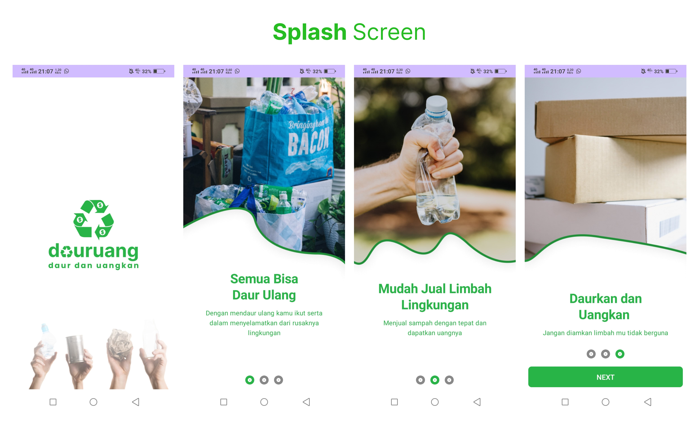
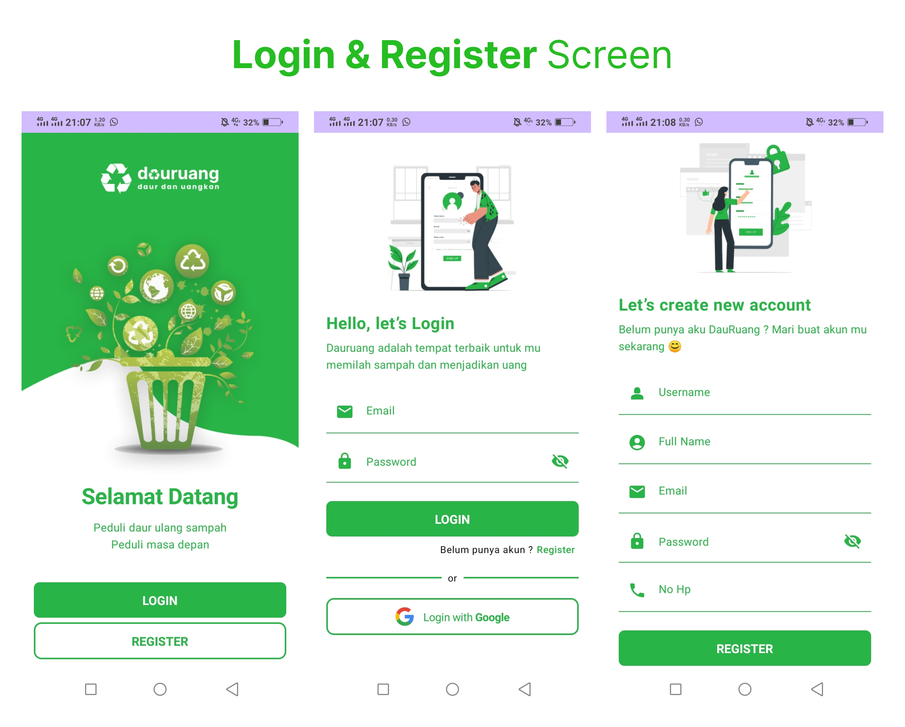
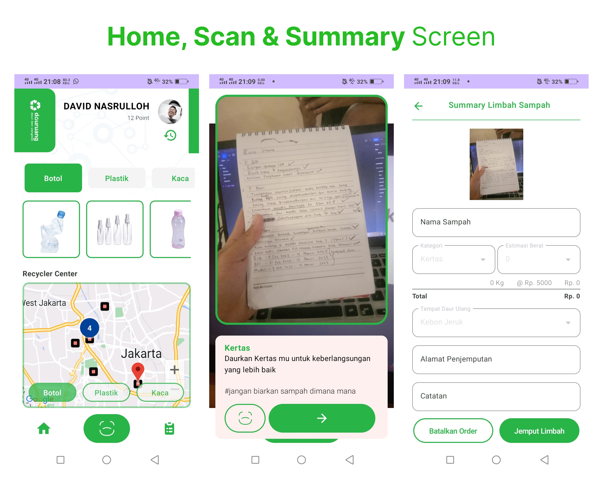
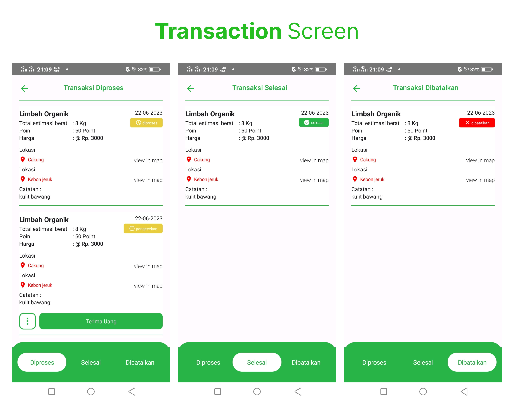

# DauRuang App

---

### `Introduction`

The name "DauRuang" consists of the words "Daur" and "Uang". The word "Daur" is taken from "Daur ulang", which means recycle and the word "Uang" means money, which is the reward generated from the collection of used waste.
In summary, "DauRuang" is a platform to make people more careful and aware about the environment by collecting waste, to make a sustainable place for our next generations.

### How to Run?

---

1. Clone this Project
2. Open in Android Studio
3. Gradle Preparation
4. Run the project 
5. Happy Testing

### Feature

---

| Feature                                 | Completed?         |
|-----------------------------------------| ------------------ |
| Login Regitser                          | :heavy_check_mark: |
| Scan Sampah                             | :heavy_check_mark: |
| Transaksi Diproses, Selesai, Dibatalkan | :heavy_check_mark: |

### Result Of this Project

1. **Splash Screen**
   

2. **Login & Register Screen**
   

3. **Home, Scan & Summary Screen**
   

4. **Transaction Screen**
   

## Deployment Result

---

[DauRuang App](https://github.com/Bangkit-2023-DauRuang/Mobile-Development-DaurRuang/releases/tag/dauruang)
